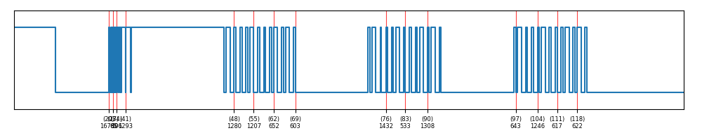
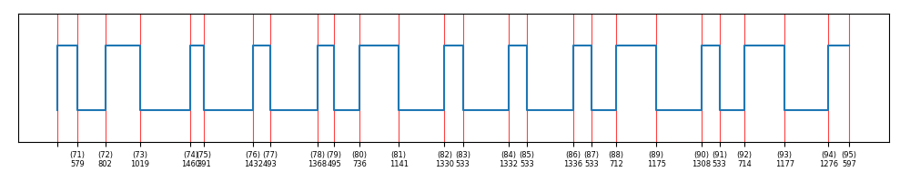

## How to use fzsubtk... an example

Capture some data in RAW mode with your Flipperzero and save it. In this example I used the name `RAW_1.sub`.

Do a first plot just to see what we have captured with: `python3 fzsubtk.py --subfile=RAW_1.sub` the result will be something like this:

When plotting you get some info in the shell, one of this can be usefull: `Total time` it's the total duration of the selected plotted piece.

The plot is interesting, I want to see better one of the 3 big blue rectangles... let's add the option `--timing-num-as-ticks` to see the timing position inside the .sub file, so we can select what we need to plot: `python3 fzsubtk.py --subfile=RAW_1.sub --timing-as-ticks`

ok, the interesting data is from timing 71 to 95 *(with a little zooming I can see the tick numbers, those in brakets indicates the position)*, so let's plot only that range with: `python3 fzsubtk.py --subfile=RAW_1.sub --timing-as-ticks --select-from=71 --select-to=95`

Wow data seems interesting, I can use the timing of each pulse (those tick numbers on the second line) to make a beeter analysis to understand the protocol.

The last feature I needed was the ability to use a fixed grid so let's try it: `python3 fzsubtk.py --subfile=RAW_1.sub --select-from=71 --select-to=95 --grid-step=579`

I used a grid of 579 as it was the lenght of the firs pulse hoping to find something interesting but I was wrong.

---

Now a little **spoiler**: the wave in the example is from an old **Nice FLO 12 Bit** with fixed code, so I know that the first pulse is only there as a starting point, it's not part of the data. So the last command I use will skip the first pulse and use a grid-step of 1868, that I obtained as 22426 (total time) / 12 (number of bit) = 1868.

`python3 fzsubtk.py --subfile=RAW_1.sub --select-from=72 --select-to=95 --grid-step=1868`

As you can see now the grid is almost perfect and the data bits are clearly readable

---

One last word... 

With fzsubtk.py you can also cut part of the .sub file and create a new .sub file with the cutted part. It may be usefull to isolate some part af the same file to make comparision or to run only part of it with your Flipperzero.

To **cut** a .sub file you need only to select the range and the name of the output:

`python3 fzsubtk.py --subfile=RAW_1.sub --select-from=72 --select-to=95 --cut --output=selection.sub`

---

The capture used in this example is available here: [RAW_1.sub](RAW_1.sub)
